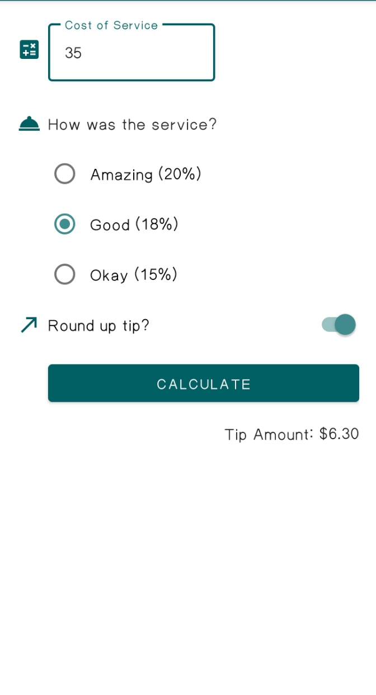
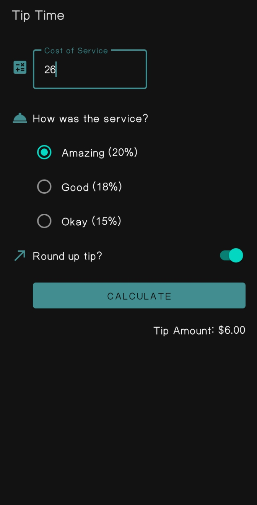

# Tip Calculator
The app will ask for the bill amount and the percentage of tip you want to leave. It will then display the tip amount. This app is written in Kotlin and uses the Kotlin Android SDK to run on Android devices and the Kotlin Compiler Plugin to compile the Kotlin code to Java. XML layouts are used to display the app.

 